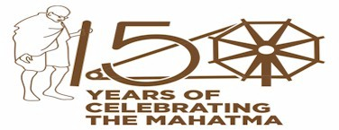

<html lang="en">
<head>
    <meta charset="UTF-8">
    <meta name="viewport" content="width=device-width, initial-scale=1.0">

    <link rel="stylesheet" href="index style.css">
    <link rel="stylesheet" href="https://cdnjs.cloudflare.com/ajax/libs/font-awesome/6.6.0/css/all.min.css" integrity="sha512-Kc323vGBEqzTmouAECnVceyQqyqdsSiqLQISBL29aUW4U/M7pSPA/gEUZQqv1cwx4OnYxTxve5UMg5GT6L4JJg==" crossorigin="anonymous" referrerpolicy="no-referrer" />
</head>
<body>
    

          wednesday,august 21 2024
    

 

    

         

        
        

        

        
        

        

            <i class="fa fa-home" aria-hidden="true"></i>
        
home

        

       
        

            <i class="fa fa-address-card" aria-hidden="true"></i>
           
about 

        

        

            <i class="fa fa-book" aria-hidden="true"></i>
            student
        

        

            <i class="fa fa-building" aria-hidden="true"></i>
            institute
        

        

            
            <i class="fa fa-eercast" aria-hidden="true"></i>
            <i class="fa fa-wpforms" aria-hidden="true"></i>
            aim
        

        

            <i class="fa fa-id-badge" aria-hidden="true"></i>
            RTI
        

        

            <i class="fa fa-wpforms" aria-hidden="true"></i>
            <!-- <i class="fa fa-eercast" aria-hidden="true"></i>
            <i class="fa fa-address-book-o" aria-hidden="true"></i> -->
            Tender
        

        

            <i class="fa fa-download" aria-hidden="true"></i>
            Downloads
            

        

            <i class="fa fa-volume-control-phone" aria-hidden="true"></i>
            contact 
        

    

    <!-- 

        

        <i class="fa-solid fa-bars"></i>
        
home

        

       
        

            <i class="fa fa-home" aria-hidden="true"></i>
           
dashboard

        

        

            <i class="fa fa-book" aria-hidden="true"></i>

            syllabus
        

        

            <i class="fa fa-volume-control-phone" aria-hidden="true"></i>
            contact us
        

       -->
    <!-- 
 -->

    

        

            <h2>"to improve equity and quality in education by administering research based valid, reliable, efficient, transparent, fair and international level assessments. "</h2>
        

        
    

    
</body>
</html>
